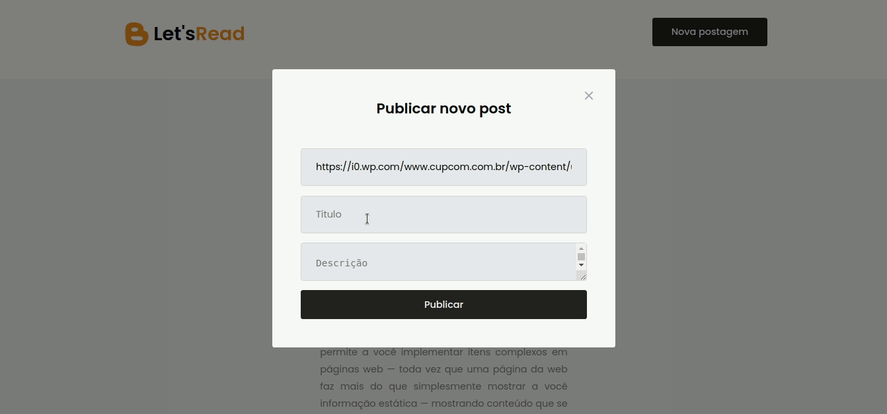

<h1 align="center">Let's <span style="color:#fc931e">Read</span> 📚</h1>


<br></br>
<p align="justify">Um projeto onde o usuário é capaz de adicionar postagens em um blog.</p>


### :nut_and_bolt: Tecnologias

Esse projeto foi desenvolvido com as seguintes tecnologias:

- [Javascript][Javascript]
- [TypeScript][Typescript]
- [React][Reactjs]
- [Axios][Axios]
- [Miragejs][Miragejs]
- [Styled-components][Styled-components]
- [Yarn][Yarn]

[Javascript]: https://developer.mozilla.org/pt-BR/docs/Web/JavaScript
[Typescript]: https://www.typescriptlang.org/
[Reactjs]: https://reactjs.org
[Axios]: https://axios-http.com/docs/intro
[Miragejs]: https://miragejs.com/
[Styled-components]: https://styled-components.com/
[Yarn]: https://yarnpkg.com/

### 🤔 Como rodar o projeto? 

```bash
# Clone o repositório
git clone https://github.com/Gabriek0/letsread.git
# Mude para o diretório do projeto
cd https://github.com/Gabriek0/letsread.git

# Instale as dependências
yarn

# Rode o projeto
yarn dev
```

### 🧑 Autor do Projeto

<table>
  <tr>
    <td align="center">
      <a href="https://github.com/Gabriek0">
        
        <br />
          <sub>
            <b>Gabriel Henrique</b>
          </sub>
      </a>
    </td>

  </tr>
</table>


